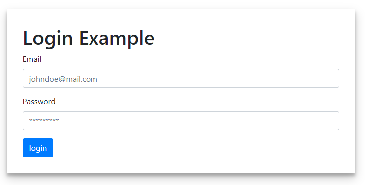

# TypeScript FormBuilder DSL

This is a project created for the SDU course 'Model-Driven Software Development'. It is a small DSL which can be used to create simple forms.

## Example implementation (Login Form)


Format: 

```typescript
import { form, container, label, input, button } from './form-builder-dsl';

window.onload = function() {
  const formWrapper = document.getElementById('FormWrapper');

  // Metamodel Login Implementation
  const loginForm = form(
    container(
      label()
        .text('Email')
        .for('EmailField')
        .end(),
      input()
        .type('text')
        .placeholder('johndoe@mail.com')
        .withClass('form-control')
        .withID('EmailField')
        .end()
    )
      .withClass('form-group')
      .end(),
    container(
      label()
        .text('Password')
        .for('PasswordField')
        .end(),
      input()
        .type('password')
        .placeholder('*********')
        .withClass('form-control')
        .withID('PasswordField')
        .end()
    )
      .withClass('form-group')
      .end(),
    button()
      .type('submit')
      .text('login')
      .clickAction(() => console.log('logged in'))
      .withClasses(['btn', 'btn-primary'])
      .end()
  )
    .useMethod('POST')
    .setAction('index.html')
    .withClass('formClass')
    .end();

  formWrapper.appendChild(loginForm);
};
```

## Installation

This is a guide on how to install and use the DSL.

##### Clone the project

###### `git clone https://github.com/Albyzai/FormBuilderDSL.git`

##### Install dependencies

###### `cd FormBuilderDSL && npm i`

##### Compile TS to JS

###### `npm start`

##### Finally open index.html in a browser to see the result.

Note: The metamodel implementation can be found in the src/index.html file
